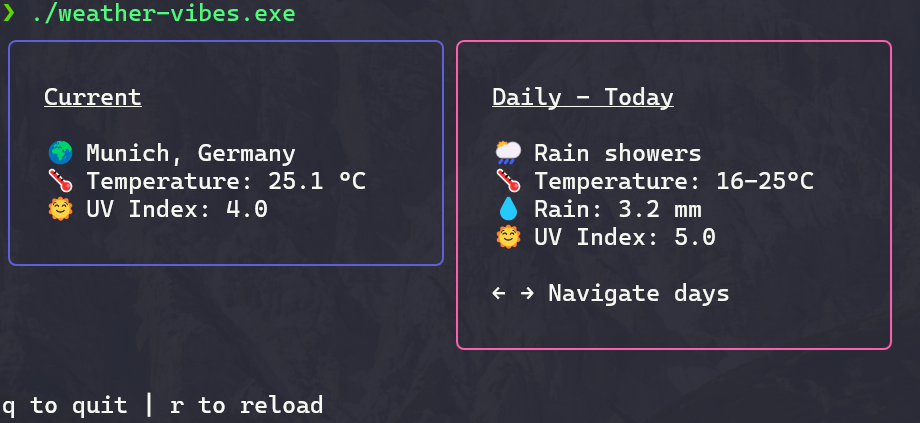

# Weather Vibes 😶‍🌫️

A terminal-based weather application built with Go and Bubble Tea. Get current weather conditions and 7-day forecasts with an interactive interface.

<div align="left">
  
</div>

## Features

- 🌍 **Automatic Location Detection** - Uses your IP to determine location
- 🌡️ **Current Weather** - Real-time temperature, humidity, UV index, and more
- 📅 **7-Day Forecast** - Interactive daily weather with arrow key navigation

## Installation

### Prerequisites

- Go 1.19 or later
- Internet connection (for API calls)

### Build from Source

1. **Install dependencies:**
   ```sh
   go mod tidy
   ```

2. **Build the application:**
   ```sh
   go build
   ```

3. **Run the application:**
   ```sh
   ./weather-vibes[.exe]
   ```

### Quick Install (if Go is installed)

```bash
go install github.com/Odin94/weather-vibes@latest
```

Then run as `weather-vibes`.

## Used APIs

- **Geolocation**: [ip-api.com](http://ip-api.com/) - Determines your location from IP
- **Weather Data**: [Open-Meteo](https://open-meteo.com/) - Provides current and forecast weather data
